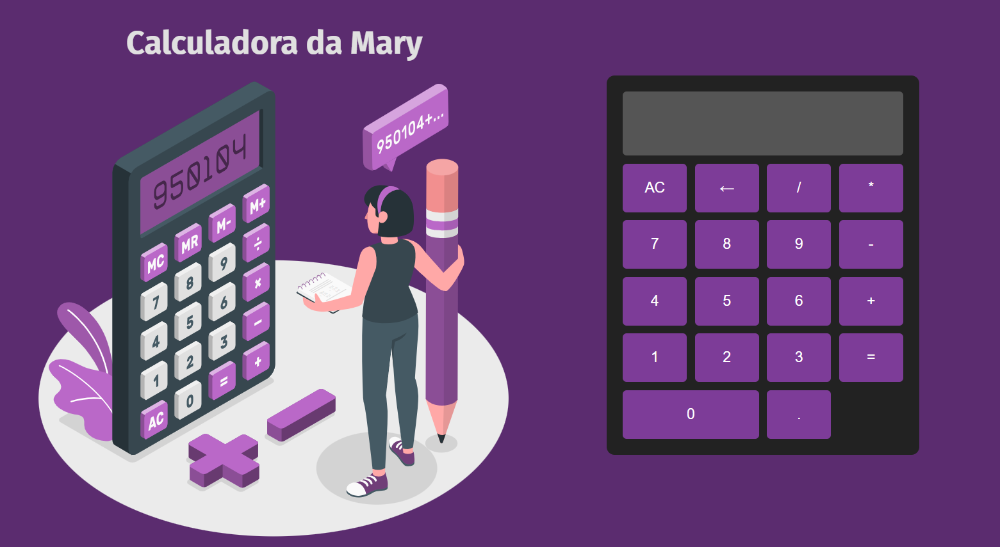

# Calculadora 🔢

## 📃 Descrição: 

Página web criada para treino, uma calculadora funcional, com modo claro e escuro.
  

## 🛠 Tecnologias:

As seguintes ferramentas foram usadas na construção do projeto:

- HTML

- CSS

- JAVASCRIPT

 
## 🌺 Apresentação 

## 🙆‍♀️ Autora 

Maria Antonia Prates

##  Colaboradores 🤝

* Google Image

* Google Fonts

* https://storyset.com/

* HTML UTF-8 Icon

* Canal "isaqueTADS" no Youtube
